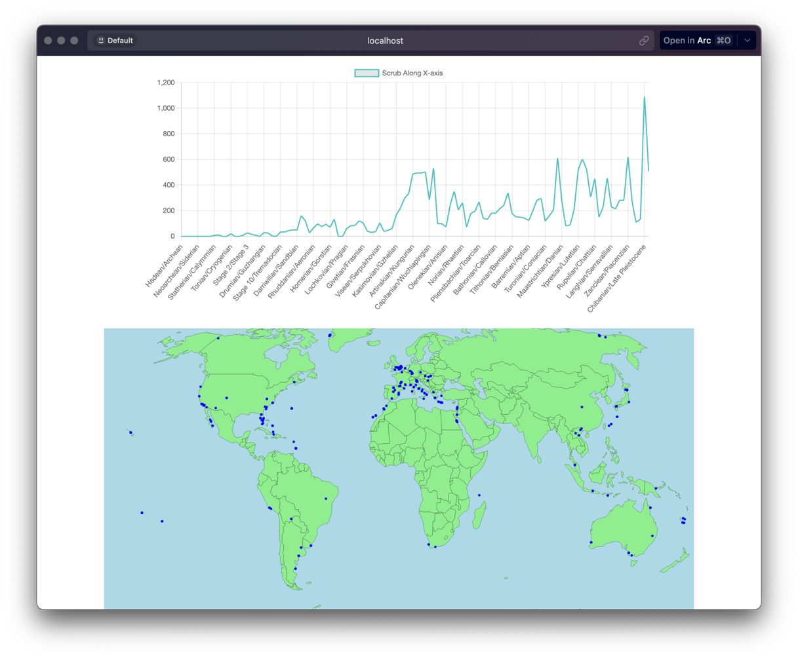

# NLSSS Pano

This is a simple web app that functions as a viewer for NLSSS patterns and occurrences. It depends on maps and JSON data generated using the `nlsss-node` application.

Based on the work of Kurt Wise and Donna Richardson.

Wise, Kurt P. and Richardson, Donna (2023) "What Biostratigraphic Continuity Suggests About Earth
History," Proceedings of the International Conference on Creationism: Vol. 9, Article 19.
DOI: 10.15385/jpicc.2023.9.1.31
Available at: https://digitalcommons.cedarville.edu/icc_proceedings/vol9/iss1/19

[Sample application on Static.app](https://nlsss-pano.static.domains)

## Maps

Maps are stored under the `images/` directory. They are generated using the `nlsss-node/generate-boundary-map` script.

## Chart

The NLSSS chart is populated using data generated by the `nlsss-node/index` script. The file `nlsss.json` must be present for the app to work.

## Usage

Run `npx serve`

Tested with Node.js 18 on MacOS
